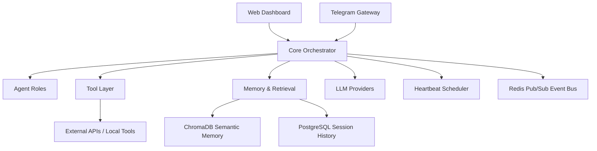

# Arrodes Case Study

Arrodes is a personal multi-agent AI assistant framework designed to bridge the gap between static LLM chat interfaces and a proactive, tool-capable personal operating system.

> **Note:** This is a public case study intended for portfolio and architectural review. The production source code remains private to protect sensitive implementation details and security configurations.

## What is Arrodes?
Arrodes is a structured system designed to manage cognitive load, persist long-term memory, and interact with the digital world through specialized agents and integrated tools. It transforms the LLM from a chatbot into a coordinator capable of managing projects, monitoring systems, and executing complex workflows.

## Implementation Scope
The following represents the verified state of the project:
* **Core Orchestration:** Fully implemented with a modular service structure.
* **Agent Logic:** Implemented via specialized roles (e.g., Researcher, Reviewer) with a structured reasoning loop.
* **Tool Integration:** Implemented using a schema-driven approach with lazy-loading to optimize context.
* **Memory Systems:** Tiered implementation using PostgreSQL for sessions and ChromaDB for semantic retrieval.
* **Interfaces:** Operational Telegram gateway and a WebSocket-based Web Dashboard.
* **Proactivity:** Implemented via a background scheduler for periodic health checks and proactive notifications.

## Core Features
* **Multi-Agent Orchestration:** Separation of concerns between different agent roles to improve output quality and reliability.
* **Dynamic Tool Calling:** A flexible schema allowing the system to interact with external APIs, local files, and third-party services.
* **Hierarchical Memory:** A multi-layered approach combining short-term session history and semantic long-term memory.
* **Proactive Workflows:** Scheduled "heartbeat" checks and automated notification systems that allow the assistant to initiate conversations based on state changes.
* **Omnichannel Interface:** Seamless interaction via a custom Web Dashboard and a Telegram gateway.

## Architecture Overview
The system follows a decoupled service-oriented approach, using **Redis Pub/Sub** for lightweight event-driven communication and **PostgreSQL** for persistent session and state management. This keeps the orchestration layer loosely coupled from interface-specific and tool-specific implementations.

## Tech Stack
* **Language:** Python
* **LLMs:** Multi-provider integration (including OpenAI, DeepSeek, and Google Gemini/Gemma).
* **Memory & Vector Store:** ChromaDB for semantic retrieval, PostgreSQL for session history.
* **Messaging & Coordination:** Redis (Pub/Sub).
* **Gateways:** Telegram Bot API, WebSocket-based Web UI.

## Engineering Deep Dives
Detailed design decisions and implementation strategies can be found in the documentation:

* [Architecture Detail](./docs/architecture.md) — The high-level system design.
* [Tool Calling Strategy](./docs/tool-calling.md) — How Arrodes interacts with the world.
* [Memory & RAG Approach](./docs/memory-and-rag.md) — Semantic retrieval and memory bridges.
* [LLM Orchestration](./docs/llm-orchestration.md) — Agent roles and provider routing.
* [Deployment & Ops](./docs/deployment-and-ops.md) — Local-first constraints and observability.
* [Lessons Learned](./docs/lessons-learned.md) — Technical tradeoffs and insights.

## Visuals
*(Placeholders for architectural diagrams and UI screenshots)*
* **System Architecture:** `assets/diagrams/architecture_diagram.png`
* **Dashboard Preview:** `assets/screenshots/dashboard_main.png`
* **Telegram Interaction:** `assets/screenshots/telegram_flow.png`

## What I Learned
Building Arrodes provided deep insights into the challenges of LLM reliability, the necessity of structured memory to avoid context window exhaustion, and the importance of a robust tool-calling validation layer.

## Roadmap
* [ ] Enhanced multi-modal support (Vision/Audio).
* [ ] More granular agent permissioning.
* [ ] Automated evaluation pipeline for tool-calling accuracy.

---
*Developed as a personal exploration into the future of agentic workflows.*
